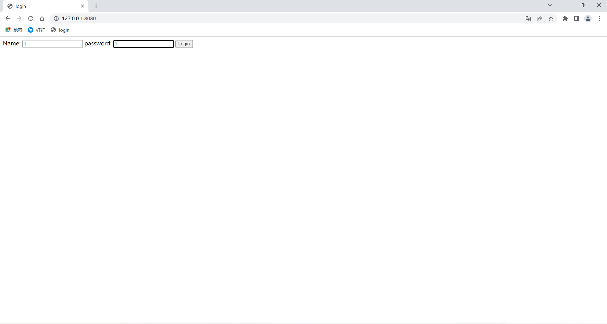
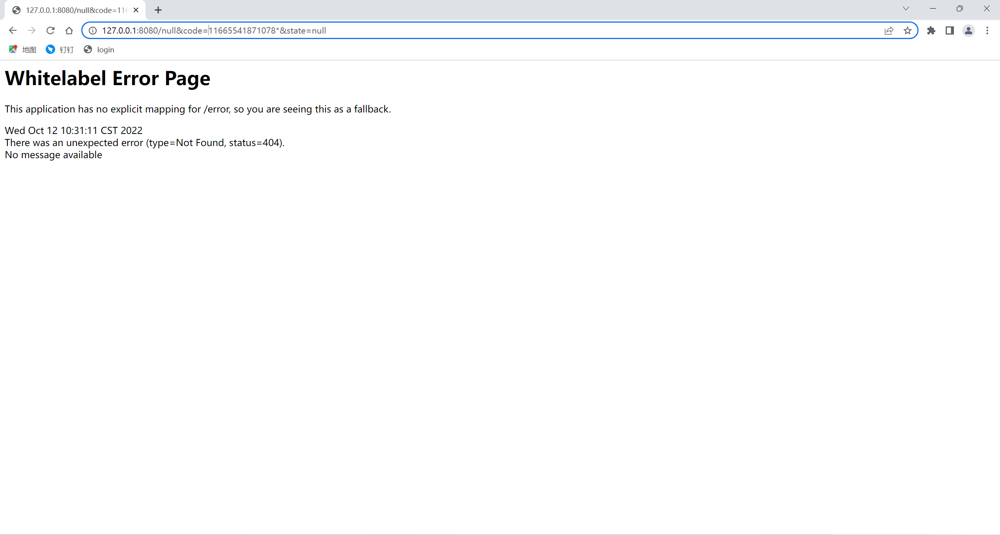
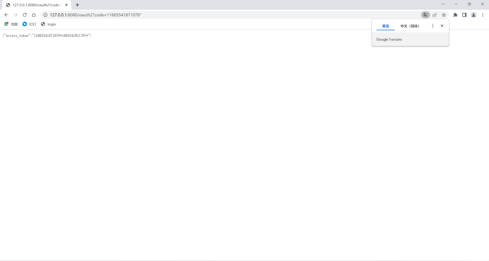
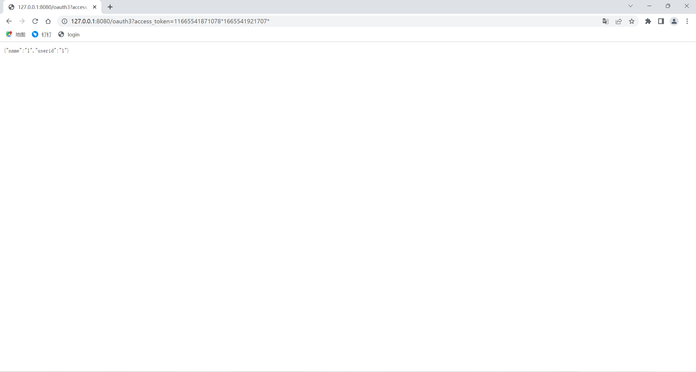
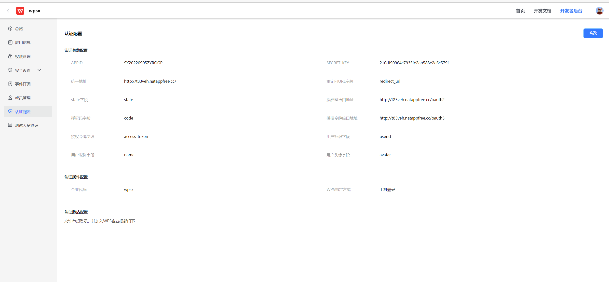
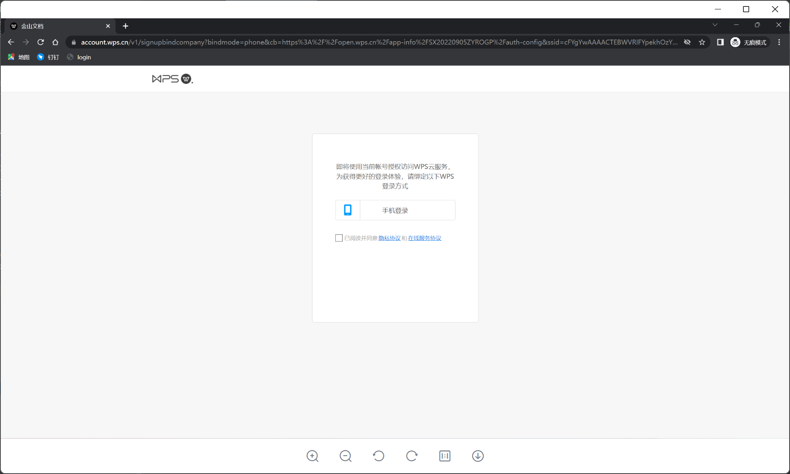

# oauthdemo

该demo可以实现oauth2.0协议，作为code，access_token,user信息的提供方。
若启动maven报错，启动前先将本地的maven配置为apache-maven-3.6.3版本
运行OauthdemoApplication类项目启动

一 .本地调试

首先登陆127.0.0.1：8080/页面

点击登录后页面跳转进入oauth1：生成带*的code

将code复制出来，页面输入127.0.0.1：8080/oauth2?code=112323123123*

页面返回access_token.页面输入127.0.0.1：8080/oauth3?access_token=1231232234234*324234234*

以上便完成了认证!

二，与wps开放平台接入
先将本地的项目运行起来后连人至外网，然后在wps配置认证信息。

使用企业代码登录即可
